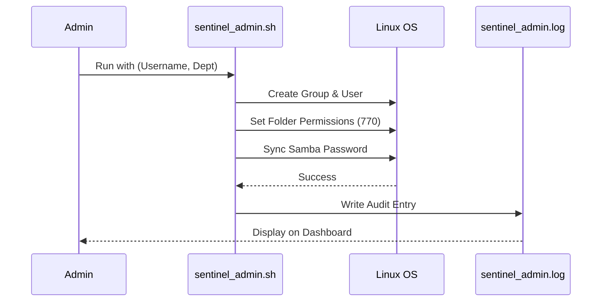

# Sentinel Node: Automated RBAC & System Monitoring

Sentinel Node is a comprehensive Linux administration suite designed for secure user onboarding, real-time system telemetry, and automated disaster recovery. It implements **Role-Based Access Control (RBAC)** to secure departmental data and provides a visual dashboard for administrators to monitor the "heartbeat" of the server.

 Enterprise-grade user provisioning, secure storage management, and real-time system telemetry for Linux server environments.

---

## 📋 Table of Contents

- [Features](#-features)
- [Architecture](#-architecture)
- [Quick Start](#-quick-start)
- [Code](#-code)
  - [sentinel_admin.sh](#1-sentinel_adminsh)
  - [sentinel_dashboard.py](#2-sentinel_dashboardpy)
  - [sentinel_backup.sh](#3-sentinel_backupsh)
- [Usage](#-usage)
- [Security](#-security)
- [Demo Script](#-demo-script)
- [License](#-license)

---

## ✨ Features

| Feature | Technology | Description |
|---------|-----------|-------------|
| **Automated Provisioning** | Bash | Creates users, groups, and secure storage with atomic operations |
| **RBAC Enforcement** | Linux 770 permissions | Department isolation via kernel-level access control |
| **Real-Time Dashboard** | Python (Rich) | TUI monitoring of CPU, RAM, disk, and services |
| **Audit Logging** | Append-only files | Immutable trail of all administrative actions |
| **Automated Backup** | Bash/Cron | 7-day rolling retention with compression |
| **Samba Integration** | smbpasswd sync | Cross-platform file sharing with unified auth |

---

## 🏗️ Architecture

---
## how to get started:

**1. Install dependencies: **
- sudo apt update && sudo apt install -y python3-pip samba openssh-server
- pip3 install rich psutil

**2. Create project directory**
- mkdir -p ~/sentinel-node/scripts 
- cd ~/sentinel-node

**3. Copy the code into the respective files**
**4. Make scripts executable**
- chmod +x scripts/*.sh

**5. Run dashboard**
- python3 scripts/sentinel_dashboard.py

**6. In another terminal, create a user**
- sudo ./scripts/sentinel_admin.sh sam HR
---
## 📝 License
MIT License - Free for educational and commercial use.
- Built with 💻 by Semoona Noor BIT22024 | System Administration & Security
- SentinelNode: Provisioning, monitoring, and compliance—infrastructure as code for the real world.
